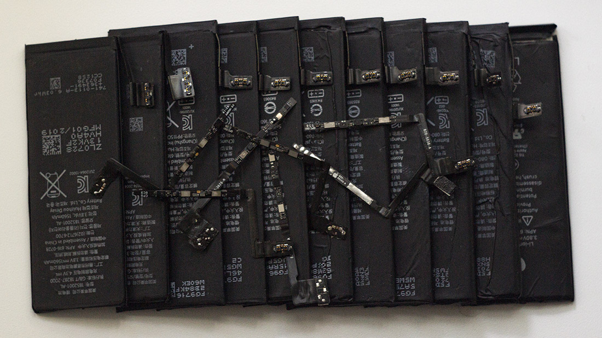

# HDQBATT


## Содержание
* [Описание](#описание)
* [Особенности](#особенности)
* [Поддерживаемые платы](#поддерживаемые-платы)
* [API](#api)
* [Установка](#установка)
* [Подключение АКБ](#подключение-акб)
* [Дополнительная документация](#дополнительная-документация)

## Описание
* Библиотека для [Arduino IDE](https://www.arduino.cc/en/software), сделана в виде класса. Позволяет получить доступ к некоторым [основным](#основные-методы) функциям ([API](https://ru.wikipedia.org/wiki/API)) 
контроллера [bq27546](https://www.ti.com/product/BQ27546-G1) от компании [Texas Instruments](https://www.ti.com/), используя для связи интерфейс [HDQ](https://www.ti.com/lit/an/slua408a/slua408a.pdf).
* *Можно* использовать для подключения к другим контроллерам семейства bq2754x, 
например [bq27541](https://www.ti.com/product/BQ27541-G1) или [bq27545](https://www.ti.com/product/BQ27545-G1), но адреса регистров и их названия будут отличатся. 
Для доступа к ним есть [вспомогательные](#вспомогательные-методы) функции.
* Эта библиотека написана по мотивам [HDQLib](https://github.com/mozzwald/HDQLib) за авторством [mozzwald](https://github.com/mozzwald). На ней я уже делал [читалку АКБ iPhone](https://github.com/S-LABc/battery-check-HDQ).

## Особенности
* Протокол [HDQ](https://www.ti.com/lit/an/slua408a/slua408a.pdf) реализован программно (софтверно), использует несколько стандартных функций [Arduino IDE](https://www.arduino.cc/en/software).
```C++
pinMode();
digitalRead();
digitalWrite();
delayMicroseconds();
```
* Библиотека позволяет читать информацию с АКБ от Apple **iPhone 4 - 7Plus** включительно. В них используется интерфейс [HDQ](https://www.ti.com/lit/an/slua408a/slua408a.pdf). Начиная с iPhone 8 используется [I²C](https://ru.wikipedia.org/wiki/I%C2%B2C).
* При использовании с микрокотроллерами, выводы которых **не толерантны к 5В**, **необходимо** использовать согласователь уровней, например [TXS0108E](https://www.ti.com/lit/ds/symlink/txs0108e.pdf)(HW-221) или подобный, иначе есть риск **спалить микроконтроллер!**

## Поддерживаемые платы
* Список плат и ядер, с которыми работает библиотека. *Проверен мной лично*. **Не забывайте про согласование уровней!**

| Плата | Ядро | Согласователь |
| :----: | :-------: | :-------: |
| STM32F103C8T6 | [Arduino_STM32](https://github.com/rogerclarkmelbourne/Arduino_STM32) | Нет |
| STM32F103C8T6 | [Arduino_Core_STM32](https://github.com/stm32duino/Arduino_Core_STM32) | Нет |
| STM32F401CCU6 | [Arduino_STM32](https://github.com/rogerclarkmelbourne/Arduino_STM32) | Нет |
| STM32F401CCU6 | [Arduino_Core_STM32](https://github.com/stm32duino/Arduino_Core_STM32) | Нет |
| STM32F411CEU6 | [Arduino_STM32](https://github.com/rogerclarkmelbourne/Arduino_STM32) | Нет |
| STM32F411CEU6 | [Arduino_Core_STM32](https://github.com/stm32duino/Arduino_Core_STM32) | Нет |
| STM32_F4VE | [Arduino_Core_STM32](https://github.com/stm32duino/Arduino_Core_STM32) | Нет |
| ESP8266 WeMos D1 Mini | [Arduino ESP8266](https://github.com/esp8266/Arduino) | [TXS0108E](https://www.ti.com/lit/ds/symlink/txs0108e.pdf) |
| ESP8266 WeMos D1 R2 | [Arduino ESP8266](https://github.com/esp8266/Arduino) | [TXS0108E](https://www.ti.com/lit/ds/symlink/txs0108e.pdf) |
| ESP32 Devkit V4 | [arduino-esp32](https://github.com/espressif/arduino-esp32) | [TXS0108E](https://www.ti.com/lit/ds/symlink/txs0108e.pdf) |
| Arduino Nano | Встроенное | Нет |
| Arduino Pro Mini | Встроенное | Нет |
| Arduino Uno | Встроенное | Нет |
| Arduino Leonardo R3 | Встроенное | Нет |
| Arduino Pro Micro | Встроенное | Нет |

## API

### Основные методы
* Проверка соединения. *Запрашивает два байта DEVICE_TYPE регистра CONTROL_STATUS*. Костыль, но работает.
```C++
bool isConnected(void);
```
* Запрос через регистр **CONTROL_STATUS**
```C++
uint16_t getControlStatus(void);
bool getFlagSEPinIsActive(void);
bool getFlagIsFullAccessSealedMode(void);
bool getFlagIsSealedMode(void);
bool getFlagCalibrationFunctionIsActive(void);
bool getFlagCoulombCounterCalibrationRoutineIsActive(void);
bool getFlagBoardCalibrationRoutineIsActive(void);
bool getFlagQMAXUpdate(void);
bool getFlagHDQInterruptFunctionIsActive(void);
bool getFlagShutdownCommandIsSent(void);
bool getFlagRequestHibernateFromSleepMode(void);
bool getFlagIsFullSleepMode(void);
bool getFlagIsSleepMode(void);
bool getFlagImpedanceTrackAlgorithm(void);
bool getFlagRaTableUpdatesDisabled(void);
bool getFlagCellVoltagesOK(void);
bool getFlagQmaxUpdatesEnabled(void);
```
* Запрос регистра **Flags()**
```C++
uint16_t getFlags(void);
bool getFlagBatteryHighIndicating(void);
bool getFlagBatteryLowIndicating(void);
bool getFlagChargeInhibitindicates(void);
bool getFlagFullChargedIsDetected(void);
bool getFlagChargeSuspend(void);
bool getFlagIndicatesComputedImax(void);
bool getFlagChargingAllowed(void);
bool getFlagStateOfChargeThreshold1(void);
bool getFlagStateOfChargeThresholdFinal(void);
bool getFlagDischargingDetected(void);
```
* Запрос **DEVICE_TYPE** через регистр *CONTROL_STATUS*
```C++
uint16_t getDeviceType(void);
```
* Запрос **FW_VERSION** через регистр *CONTROL_STATUS*
```C++
float getFirmwareVersion(void);
```
* Запрос **HW_VERSION** через регистр *CONTROL_STATUS*
```C++
float getHardwareVersion(void);
```
* Запрос регистра **Temperature()**
```C++
float getTemperatureKelvin(void);
float getTemperatureCelsius(void);
float getTemperatureFahrenheit(void);
```
* Запрос регистра **Voltage()**
```C++
unsigned short getVoltageMilli(void);
float getVoltage(void);
```
* Запрос регистра **DesignCapacity()**
```C++
unsigned short getDesignCapacity(void);
```
* Запрос регистра **RemainingCapacity()**
```C++
unsigned short getRemainingCapacity(void);
```
* Запрос регистра **FullChargeCapacity()**
```C++
unsigned short getFullChargeCapacity(void);
```
* Запрос регистра **AverageCurrent()**
```C++
short getAverageCurrentMilli(void);
float getAverageCurrent(void);
```
* Запрос регистра **AveragePower()**
```C++
short getAveragePowerMilli(void);
float getAveragePower(void);
```
* Запрос регистра **CycleCount()**
```C++
unsigned short getCycleCount(void);
```
* Запрос регистра **StateOfCharge()**
```C++
byte getStateOfCharge(void);
```
* Запрос регистра **TimeToEmpty()**
```C++
unsigned short getTimeToEmpty(void);
```
* Запрос регистров **Manufacturer Information Blocks**
```C++
char* getManufacturerInfoBlockA(void);
char* getManufacturerInfoBlockB(void);
```
Этот блок не описан в докумментации, но в нем есть информация. *Смотрите [bq27541 Single Cell Li-Ion Battery Fuel Gauge for Battery Pack Integration](https://www.ti.com/lit/ds/symlink/bq27541.pdf)*
```C++
char* getManufacturerInfoBlockC(void);
```
* Запрос регистра **BlockDataChecksum()**
```C++
uint8_t getBlockDataChecksum(void);
```

### Вспомогательные методы
* байт из одиночного и слово из парного регистров
```C++
uint8_t readByte(uint8_t reg);
uint16_t readWord(uint8_t low_reg, uint8_t high_reg);
```
* слово из регистра Control()
```C++
uint16_t readControlAddresses(void);
```
* байт в одиночный и слово в парный регистры
```C++
void writeByte(uint8_t reg, uint8_t payload);
void writeWord(uint8_t low_reg, uint8_t high_reg, uint8_t low_payload, uint8_t high_payload);
```
* слово в регистр Control()
```C++
void writeControlAddresses(uint8_t low_payload, uint8_t high_payload);
```

### Настройки задержек HDQ
* Эти значения настраиваются при необходимости. Смотрите 7.13 HDQ Communication Timing Characteristics.
```C++
bool setTimeCYCH(uint8_t new_delay);
bool setTimeCYCD(uint8_t new_delay);
bool setTimeHW1(uint8_t new_delay);
bool setTimeDW1(uint8_t new_delay);
bool setTimeHW0(uint8_t new_delay);
bool setTimeDW0(uint8_t new_delay);
bool setTimeRSPS(uint16_t new_delay);
bool setTimeB(uint16_t new_delay);
bool setTimeBR(uint16_t new_delay);
```
* Этой задержки нет в документации. Она настраивает время ожидания ответа от контроллера, после передачи ему байта.
```C++
bool setTimeFailTries(uint16_t new_delay);
```

## Установка
[Скачать ZIP-архив](https://github.com/S-LABc/HDQBATT/archive/refs/heads/main.zip) этого репозитория. Запустить [Arduino IDE](https://www.arduino.cc/en/software). Выбрать *Скетч* -> *Подключить библиотеку* -> *Добавить .ZIP библиотеку*. В появившемся окне выбрать скаченный архив. Более [наглядная](https://wiki.iarduino.ru/page/Installing_libraries) инструкция. Изучите скетч из примеров, в нем показано важное.

## Подключение АКБ
* Для корректной передачи данных, необходимо между контактом **HDQ** и **+VBATT** АКБ подключить резистор  номиналом 4.7кОм - 10кОм.
* *Можно* подключить резистор к контакту +5В, но делать этого я **не рекомендую**, если контакт **не толерантен к 5В.**

## Дополнительная документация
* [HDQ Communication Basics](https://www.ti.com/lit/an/slua408a/slua408a.pdf)
* [HDQ Communication Basics for TI’s Battery Monitor ICs](https://www.ti.com/lit/an/slva101/slva101.pdf)
* [Start Guide for the BQ27546-G1](https://www.ti.com/lit/an/slua917/slua917.pdf)
* [Configuring the bq2754x Data Flash](https://www.ti.com/lit/an/slua503/slua503.pdf)
* [bq27546-G1 Technical Reference Manual](https://www.ti.com/lit/ug/sluub74/sluub74.pdf)
* [bq27546-G1 Single-Cell Li-Ion Battery Fuel Gauge for Battery Pack Integration](https://www.ti.com/lit/ds/symlink/bq27546-g1.pdf)
* [bq27545-G1 Single Cell Li-Ion Battery Fuel Gauge for Battery Pack Integration](https://www.ti.com/lit/ds/symlink/bq27545-g1.pdf)
* [bq27425-G2 System-Side Impedance Track™ Fuel Gauge With Integrated Sense Resistor](https://www.ti.com/lit/ds/symlink/bq27425-g2a.pdf)
* [bq27541 Single Cell Li-Ion Battery Fuel Gauge for Battery Pack Integration](https://www.ti.com/lit/ds/symlink/bq27541.pdf)
